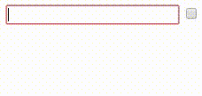

# ngx-input-flow

> Fast & smooth list input for Angular

[](https://travis-ci.org/jeysal/ngx-input-flow)
[](https://codecov.io/gh/jeysal/ngx-input-flow)

[](https://www.npmjs.com/package/ngx-input-flow)
[](https://github.com/jeysal/ngx-input-flow/blob/master/LICENSE)

*No more 'add' or 'remove' buttons.  
Create multiple elements just by tabbing through the controls.  
Remove empty elements automatically.*



## Installation

`npm install --save ngx-input-flow`

## Usage

Import the module:

```typescript
import { InputFlowModule } from 'ngx-input-flow';

@NgModule({
  imports: [
    // ...
    InputFlowModule,
  ],
  // ...
})
export class MyModule {}
```

Use the ngx-input-flow directives in the template of your component:  
_(this example assumes the component has a `persons` property)_

```html
<table [(ngxInputFlow)]="persons" <!-- 1 -->
       #input="ngxInputFlow"> <!-- 2 -->
  <tr *ngFor="let person of input.flow()" <!-- 3 -->
      [ngxInputFlowModel]="person"> <!-- 4 -->
    <td>
      <input type="text" name="name" [(ngModel)]="person.name"> <!-- 5 -->
    </td>
    <td>
      <input type="checkbox" name="invited" [(ngModel)]="person.invited"> <!-- 6 -->
    </td>
  </tr>
</table>
```

1. Two-way bind the array that stores the elements that are to be edited.
2. Bind the `ngxInputFlow` directive to the template variable `input`.
3. Bind `ngForOf` to `input.flow()` instead of the array itself.
4. Use `ngxInputFlowModel` to monitor changes to each element.
5. Two-way bind `ngModel` as usual.
6. Other input types work as well!

You can find some more examples in the `e2e` folder that is used for end-to-end tests.

### Configuration options

#### ngxInputFlow options

| Input           | Type                                          | Default                                         |
| --------------- | --------------------------------------------- | ----------------------------------------------- |
|`checkElements`  | <code>'None' &#124; 'New' &#124; 'All'</code> |`'None'`                                         |
|`emptyWhen`      |`any => boolean`                               |`item => Object.values(item).every(val => !val);`|
|`emptyItem`      |`() => any`                                    |`() => ({})`                                     |

**checkElements** determines which elements of the array will be checked for emptiness during every change detection cycle.
Discovered empty elements will be removed automatically.
This does not affect the checks on user input, which are triggered by the `ngxInputFlowModel` directive.
Instead, it allows for additional checks in case the array is modified or replaced externally (i.e. not by user input).  
`'None'` (the default) disables all checks.
It is recommended you ensure that no empty elements are inserted into the array from your program code
to avoid annoying the user with intermediate empty elements.  
`'New'` checks only elements that have been added since the last change detection cycle.  
`'All'` checks the complete array every time. This is the least performant option.

**emptyWhen** is a function that determines whether an elements is considered empty.
It takes the element as its only parameter. It returns `true` if the element is empty and `false` if it is not.
The default considers elements empty if they have no truthy properties.

**emptyItem** is a function that supplies new elements to be used as trailing empty elements for the user to modify.
If the user edits them and they become non-empty, they will be appended to the array itself.
The default supplies empty objects (`{}`).

#### ngxInputFlowModel options

| Input           | Type                                          | Default                                         |
| --------------- | --------------------------------------------- | ----------------------------------------------- |
|`focusDebounce`  | number                                        |`500`                                            |

**focusDebounce** specifies the delay after the last focus event before the array is checked for elements that were left empty and those are removed.
A too low value can cause trouble for mouse users if they clear one element and then click on a subsequent one,
because the empty element could be removed and cause all subsequent inputs to change its position (e.g. slide up), including the one the user is currently clicking.  
The directive makes sure the currently focused element is never checked.  
When using multiple `ngxInputFlowModel` inside a `ngxInputFlow` directive, those may be assigned different `focusDebounce` values.
If subsequent focus events are detected by `ngxInputFlowModel` instances with different `focusDebounce` values, only the last value will be used to compute the delay.
Note that if a `focusout` is detected by a `ngxInputFlowModel` with the `focusDebounce` set to `0`, checks will be performed immediately,
even if another instance with a higher value receives focus immediately after.

## FAQ

**Q: Is this package stable yet?**  
A: This is an alpha version that might not work in all cases quite yet.
A stable 1.0.0 will be published once more testing and polishing is done.

**Q: How do I use this within a form?**  
A: A variable number of form controls is problematic, because every control needs to have a unique `name`.
You'd probably be best off excluding the controls from the form management by declaring it standalone:

`[ngModelOptions]="{ standalone: true }"`

**Q: Can I put `ngxInputFlow` and `ngxInputFlowModel` on the same element?**  
A: **No**, `ngxInputFlow` needs to be above the `*ngFor` element and `ngxInputFlowModel` needs to be on or below it.
If you move `ngxInputFlow` down to the `*ngFor` element, you cannot access `input.flow()` anymore.
If you move `ngxInputFlowModel` above the `*ngFor`, you cannot access the current element anymore.

**Q: Why is the usage so complicated?**  
A: This is a product of multiple iterations and the first one that does not feel like it's totally counteracting Angular's mechanics.
If you have any ideas for a better architecture that can provide the same functionality,
please share your ideas with an issue or pull request.

**Q: Can I use iterables other than arrays?**  
A: **Yes and no**, you can pass any iterable into the `ngxInputFlow` input and it should work,
but `ngxInputFlow` will always emit an array as its output.

**Q: Is there a TS/JS API that I can use to do some fancy stuff?**  
A: The package also exports an `ArrayManager` that you can inject inside of an element with `ngxInputFlow` on it.
It primarily has some methods to perform emptiness checks on parts of the array.
